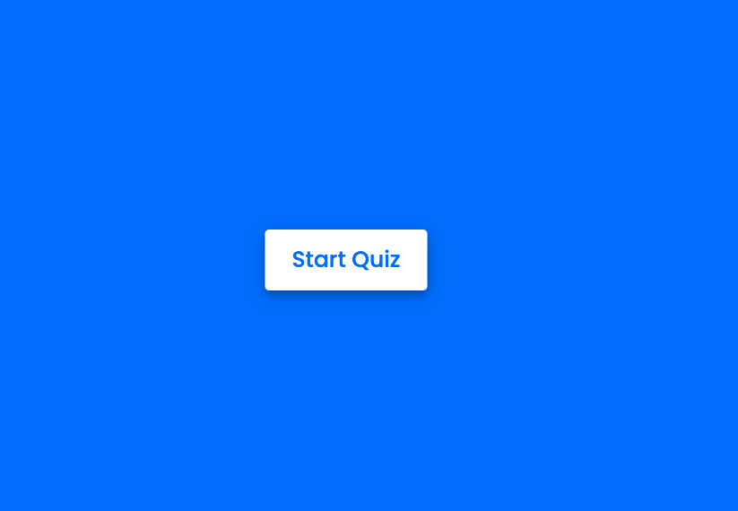
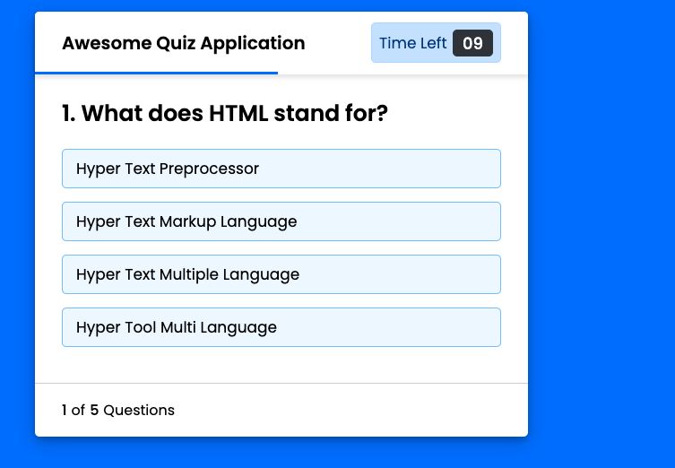

# code-quiz

Welcome to my project
in this project we used javasccript htmland css.
In this Application javascript is used mainly to collect data from the user.
Based on the input by the user it checks for the answers to be correct or not,
it generates a score that  includes a result page from the user data.

How to take the code quiz
WHEN you click the start button
THEN a timer starts and You are presented with a question
WHEN  you answer a question
THEN  you are  presented with another question
WHEN you  answer a question incorrectly
THEN time is subtracted from the clock
WHEN all questions are answered or the timer reaches 0
THEN the game is over
WHEN the game is over
THEN  you  can save my initials and score

[github repo](https://github.com/zohamumtaz/code-quiz)  
[Deployed link](https://zohamumtaz.github.io/code-quiz/.)
